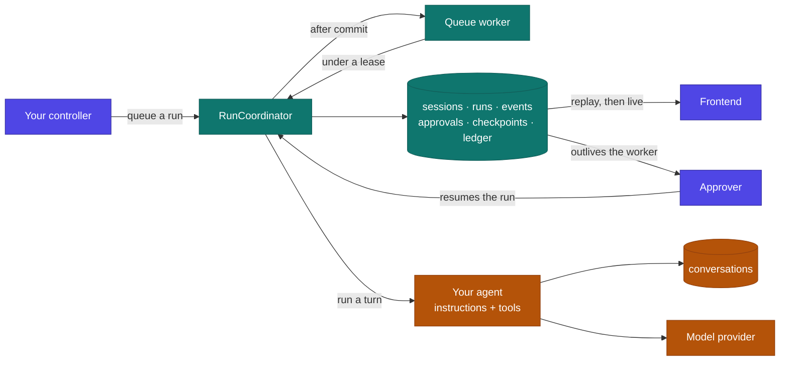

# Laravel Agent Harness

Durable, observable agent runtimes for Laravel, powered by the official [Laravel AI SDK](https://laravel.com/docs/ai).

Laravel Agent Harness adds the runtime layer that long-running application agents need: persistent sessions, resumable runs, event replay, human approvals, artifacts, budgets, cancellation, and pluggable runtime drivers.

The Laravel AI SDK remains the model and tool engine. Laravel Agent Harness owns everything around the engine.

```php
$session = Harness::agent(ResearchAgent::class)->for($user)->create();

$result = $session->prompt('Research our competitors and recommend a wedge.');
```

That looks like a normal call. The difference is what survives it: the session, the run, every event in order, the usage, the artifacts, and the ability to pick all of it back up in another process tomorrow.

---

## Why this exists

The official Laravel AI SDK makes it beautifully simple to define an agent, give it tools, and prompt it:

```php
$response = (new ResearchAgent)->prompt('Research our competitors and create a positioning brief.');
```

That is the agent **engine**. It handles the conversation with the model, executes the tool loop, and returns a response.

But a production agent rarely fits neatly inside one request and one response.

Imagine that research agent needs to inspect 50 websites, call several APIs, produce a document, and ask for approval before publishing it. While it works:

- The user closes the browser and comes back later.
- A deployment restarts the queue worker.
- An API rate limit forces a delayed retry.
- A publishing tool succeeds, but the worker dies before recording its result.
- The agent pauses for approval and gets the decision hours later, in another process.
- The frontend disconnects after event 42 and needs the events it missed.
- The run hits its cost ceiling and has to stop safely.

Laravel AI provides many of the primitives involved — agents, conversations, tools, streaming, queues, approvals, sub-agents, MCP, structured output, provider abstraction. What it does not try to be is the durable runtime that owns the complete lifecycle of that work.

Without a harness, every application ends up rebuilding the same infrastructure: session and run tables, queue orchestration and execution locks, status transitions and audit history, stream persistence and reconnect logic, approval endpoints and continuation jobs, checkpoints and crash recovery, tool idempotency, cancellation, budgets, usage accounting, artifact storage, tenant isolation, redaction, and operational tooling.

This package makes those concerns a reusable, Laravel-native layer.

| Question | Owner |
| --- | --- |
| Which model should answer this prompt? | Laravel AI |
| Which tools can the model call? | Laravel AI and your application |
| What conversation context does the model receive? | Laravel AI conversation |
| Who owns the run after the HTTP request ends? | **Laravel Agent Harness** |
| What happens when the browser or worker disconnects? | **Laravel Agent Harness** |
| Has this tool already performed its side effect? | **Laravel Agent Harness** |
| How does an approval resume in another process? | **Laravel Agent Harness** |
| What exactly happened, in what order, and at what cost? | **Laravel Agent Harness** |

> **Laravel AI runs the agent. Laravel Agent Harness keeps the agent running safely.**

This is not another model abstraction or agent framework. It is the missing production runtime around Laravel AI, built on Laravel's own queues, events, broadcasting, storage, policies, database, container, and testing fakes.

---


## Where it sits

The harness wraps Laravel AI rather than replacing it. Your agents, tools, and
provider configuration stay exactly as they are — the harness owns the lifecycle
around them.



<sub>**Indigo** is yours · **teal** is the harness · **amber** is Laravel AI.</sub>

Read it as three responsibilities:

- **Laravel AI** talks to the model, runs the tool loop, and remembers the
  conversation. Untouched.
- **The harness** decides when a turn starts, what is recorded, who may approve
  what, when to stop, and how to pick the work back up. Every state change goes
  through one coordinator, so the transaction rules hold in one place.
- **Your application** starts work, renders progress, and decides who approves.

The dashed arrows are the parts that make it durable: the queue job is
dispatched only after the run's state commits, events are persisted before they
are broadcast, and an approval resolved in a completely separate process is what
resumes the run.

### What one turn actually does

```
   $session->prompt(…)
        │
        ├─ createRun ─────────────── run.created        ← one active run per session, enforced by a row lock
        ├─ acquire session lease ─────────────────────  ← one worker, or the job exits
        ├─ restore checkpoint ────────────────────────  ← the conversation the last turn left
        ├─ transition to running ── run.started
        │
        │   ┌─ driver: Laravel AI stream ──────────────┐
        │   │  step.started                            │
        │   │  text.delta × n                          │
        │   │  tool.call.requested   ← ledger checks   │  budgets checked at each
        │   │  tool.call.completed     idempotency     │  boundary; cancellation
        │   │  step.completed                          │  observed before any new step
        │   └──────────────────────────────────────────┘
        │
        ├─ store checkpoint ──────── checkpoint.created
        ├─ usage.updated
        └─ commit terminal state ── run.completed       ← state, result and event commit together;
                                                          the active-run slot clears in the same write
```

If the agent hits an approvable tool, the middle of that diagram ends at
`run.awaiting_approval` instead, the worker exits, and the whole sequence
resumes from the checkpoint whenever the decision arrives.

---

## Requirements

- PHP 8.3+
- Laravel 12 or 13
- `laravel/ai` 0.11+
- PostgreSQL recommended for production
- Redis recommended for queues, leases, and broadcasting

## Installation

```bash
composer require obaid/laravel-agent-harness

# The harness's own tables.
php artisan vendor:publish --provider="AgentHarness\Laravel\AgentHarnessServiceProvider"

# Laravel AI's conversation tables, if you have not published them already.
# The harness stores session context there, so this step is not optional.
php artisan vendor:publish --provider="Laravel\Ai\AiServiceProvider"

php artisan migrate
```

Configure at least one Laravel AI provider as described in the [Laravel AI documentation](https://laravel.com/docs/ai).

Give agents their own queue while you are here — a run that takes four minutes should not sit in front of your password-reset emails:

```env
AGENT_HARNESS_QUEUE_CONNECTION=redis
AGENT_HARNESS_QUEUE=agents
```

```bash
php artisan queue:work redis --queue=agents
```

---

## The mental model

Five concepts, and that is the whole surface:

| Concept | Meaning |
| --- | --- |
| **Agent** | A Laravel AI agent class: instructions and tools |
| **Session** | Durable agent identity, context, configuration, optional workspace |
| **Run** | One execution attempt inside a session |
| **Event** | An append-only fact emitted during a run |
| **Artifact** | A durable output: a document, report, image, export |

A session may contain many sequential runs. **A session has exactly one active run at a time.**

---

## Quick start

### 1. Create an agent

```bash
php artisan make:harness-agent ResearchAgent
```

That generates an ordinary Laravel AI agent with one thing already wired up:

```php
namespace App\Ai\Agents;

use Laravel\Ai\Concerns\RemembersConversations;
use Laravel\Ai\Contracts\Agent;
use Laravel\Ai\Contracts\HasTools;
use Laravel\Ai\Contracts\RemembersConversations as RemembersConversationsContract;
use Laravel\Ai\Promptable;
use Stringable;

class ResearchAgent implements Agent, HasTools, RemembersConversationsContract
{
    use Promptable;

    // Laravel AI persists this agent's conversation, which is what lets a
    // harness session continue across requests, workers and deployments.
    use RemembersConversations;

    public function instructions(): Stringable|string
    {
        return 'You research competitors and write positioning briefs.';
    }

    public function tools(): iterable
    {
        return [new SearchWeb, new FetchPage];
    }
}
```

> **The `RemembersConversations` trait is not optional.** Laravel AI only persists a conversation for agents that use it, and both durable sessions and cross-process approvals depend on that conversation. The harness refuses to create a session for an agent without it, and the error message tells you exactly what to add. For a genuinely single-turn agent, opt out explicitly with `->configure('stateless', true)`.

### 2. Create a session and prompt it

```php
use AgentHarness\Laravel\Facades\Harness;
use App\Ai\Agents\ResearchAgent;

$session = Harness::agent(ResearchAgent::class)
    ->for($request->user())
    ->name('Competitor research')
    ->create();

$result = $session->prompt(
    'Research our three closest competitors and recommend a positioning wedge.'
);

return [
    'session_id' => $session->id,
    'run_id' => $result->run->id,
    'text' => $result->text,
    'artifacts' => $result->artifacts,
    'usage' => $result->usage,
];
```

The harness persists the session, run, events, tool activity, approvals, artifacts, usage, and terminal result.

### 3. Continue it later

```php
$session = Harness::session($sessionId)->authorizeFor($request->user());

$result = $session->prompt('Turn the recommendation into a one-page strategy memo.');
```

The driver restores the right conversation and runtime state. You never replay chat messages by hand.

---

## Background runs

Queue a run for long-running work:

```php
$run = $session->queue('Analyze every page on our website and produce a content gap report.');

return response()->accepted([
    'session_id' => $session->id,
    'run_id' => $run->id,
    'status' => $run->status,
]);
```

Configure queue behavior globally in `config/agent-harness.php`, or per session:

```php
$session = Harness::agent(ResearchAgent::class)
    ->for($user)
    ->onConnection('redis')
    ->onQueue('agents')
    ->timeout(seconds: 900)
    ->create();
```

Give agents their own queue. A run that takes four minutes should never sit in front of your password-reset emails.

---

## Streaming and reconnecting

Stream a run straight from a controller:

```php
Route::post('/research', function (Request $request) {
    $session = Harness::session($request->session_id)->authorizeFor($request->user());

    return $session
        ->stream('Create the report and explain your progress.')
        ->usingVercelDataProtocol();
});
```

That plugs directly into the Vercel AI SDK's `useChat`. Drop `usingVercelDataProtocol()` to stream the harness's own event envelope instead.

For queued runs, clients consume the harness event stream:

```http
GET /api/agent-harness/runs/{run}/events?after=42
Accept: text/event-stream
```

Every event carries a monotonically increasing sequence number. If the browser disconnects after event `42`, it reconnects with `after=42`; the server replays stored events and then continues live.

Delivery is at least once. **Consumers deduplicate by `(run_id, sequence)`.**

The same history is recorded whether a run was streamed directly or executed on a queue, so a reconnecting client's view never depends on how the run was started.

---

## Human approval

Laravel AI approvable tools surface automatically as durable harness approvals.

```php
use Laravel\Ai\Concerns\InteractsWithApprovals;
use Laravel\Ai\Contracts\Approvable;

class PublishArticle implements Tool, Approvable
{
    use InteractsWithApprovals;

    // ...
}
```

When the agent reaches that tool, the run pauses, a checkpoint is written, and the worker **exits normally**. Nothing is held open. Hours or days later, in a different process:

```php
$run = Harness::run($runId)->authorizeFor($user);

$run->approve(
    approvalId: $approvalId,
    reason: 'The content has been reviewed and may be published.',
);
```

Reject an action:

```php
$run->reject(
    approvalId: $approvalId,
    reason: 'Do not publish this draft. Remove the unsupported claim first.',
);
```

A rejection reaches the agent as a tool result it can react to, rather than killing the run.

An approval decision is **idempotent**: repeating the same decision returns the existing result. Attempting to reverse a resolved decision raises `ApprovalAlreadyResolved`.

The package ships endpoints for all of this:

```http
GET  /api/agent-harness/runs/{run}/approvals
POST /api/agent-harness/runs/{run}/approvals/{approval}/approve
POST /api/agent-harness/runs/{run}/approvals/{approval}/reject
```

Hook your own notifications off the event:

```php
Event::listen(ApprovalRequested::class, function (ApprovalRequested $event) {
    $event->approval->session->participant->notify(
        new AgentNeedsYou($event->approval)
    );
});
```

### Permission modes

```php
use AgentHarness\Laravel\Enums\PermissionMode;

$session = Harness::agent(PublishingAgent::class)
    ->for($user)
    ->permissions(PermissionMode::ApproveSensitive)
    ->create();
```

| Mode | Behavior |
| --- | --- |
| `DenyByDefault` | Only explicitly allowed tools may run |
| `ApproveSensitive` | Safe tools run; sensitive tools require approval |
| `ApproveAll` | Every state-changing tool requires approval |
| `AllowAll` | Tools run without harness approval; for trusted environments |

Classify your tools in `config/agent-harness.php`:

```php
'permissions' => [
    'tools' => [
        'search_web' => 'read_only',
        'draft_email' => 'reversible',
        'send_email' => 'irreversible',
    ],
],
```

Or let a tool speak for itself:

```php
class PublishArticle implements Tool, SensitiveTool
{
    public function sensitivity(): ToolSensitivity
    {
        return ToolSensitivity::Irreversible;
    }
}
```

**A tool you have not classified is treated as sensitive.** Guessing in the safe direction is the only guess worth making.

To make the mode apply, hand your tool list through `Harness::policy()`:

```php
public function tools(): iterable
{
    return Harness::policy([
        new SearchWeb,
        new DraftEmail,
        new PublishArticle,
    ]);
}
```

Laravel AI asks the agent for its tools on every turn and the list is usually built fresh each time, so the harness cannot rewrite it after the fact — the agent passes it through instead. `make:harness-agent` generates this for you.

With that in place:

- A tool the mode **denies** is withheld from the agent entirely. The model is never told it exists, because refusing after the fact would still have exposed the capability.
- A tool that **needs sign-off** is marked approvable, which is what turns it into a durable harness approval and pauses the run.
- Outside a harness run, `Harness::policy()` is a no-op, so the same agent still behaves normally when prompted directly through Laravel AI.

A tool that asks for approval on its own — via Laravel AI's `requireApproval()` — is making its author's declaration, not the harness's. `AllowAll` relaxes the harness policy; it does not override the tool.

Laravel authorization policies still apply regardless of permission mode. Application rules can layer on too, and the most restrictive result wins:

```php
app(PolicyEngine::class)->extend(function (ToolInvocation $invocation, ToolSensitivity $sensitivity) {
    return $invocation->tenantId && Team::find($invocation->tenantId)?->on_trial
        ? PolicyDecision::requireApproval('Trial teams review every write.')
        : null; // Defer to the other rules.
});
```

---

## Budgets

Constrain a session or an individual run:

```php
use AgentHarness\Laravel\ValueObjects\RunBudget;

$session = Harness::agent(ResearchAgent::class)
    ->for($user)
    ->budget(new RunBudget(
        maxSteps: 40,
        maxToolCalls: 100,
        maxTokens: 250_000,
        maxCostUsd: 8.00,
        maxDurationSeconds: 900,
    ))
    ->create();
```

Budgets layer: configuration defaults, then the session, then the run. **The most restrictive limit at each level wins** — a session can tighten a limit, never loosen it.

When a hard budget is reached, the run transitions to `budget_exceeded`, emits a terminal event naming the limit that ran out, and keeps its last safe checkpoint.

Usage carries across attempts by default, so a failing retry loop cannot spend the same budget repeatedly. Reset it explicitly when you mean to:

```php
$run->retry(resetBudget: true);
```

For `maxCostUsd` to do anything, tell the harness what your models cost:

```php
// config/agent-harness.php
'pricing' => [
    'anthropic:claude-sonnet-4-5' => ['input' => 3.00, 'output' => 15.00],
    'openai:gpt-5' => ['input' => 1.25, 'output' => 10.00],
],
```

An unpriced model contributes `0.00` rather than a guess, which is visible in the usage record rather than silently wrong.

---

## Cancellation

```php
$run = Harness::run($runId)->authorizeFor($user);

$run->cancel(reason: 'The request is no longer needed.');
```

Cancellation is **cooperative**. The harness records the request immediately, signals the active driver, and prevents any new model step or tool from starting. A tool already executing may finish unless that tool supports interruption — the package does not pretend otherwise.

Long-running tools can cooperate:

```php
public function handle(Request $request): string
{
    foreach ($this->pages() as $page) {
        if (RunContext::current()?->isCancelled()) {
            break;
        }

        $this->analyze($page);
    }
}
```

---

## Artifacts

Agents and tools attach durable outputs to a run:

```php
use AgentHarness\Laravel\Artifacts\Artifact;
use AgentHarness\Laravel\Runtime\RunContext;

$artifact = Artifact::fromStorage(disk: 's3', path: 'reports/content-gap-2026-08-24.pdf')
    ->name('Content gap report')
    ->mimeType('application/pdf')
    ->metadata(['pages' => 18]);

RunContext::current()->artifacts()->add($artifact);
```

Or write the bytes as part of attaching them:

```php
Artifact::fromContents($markdown, 'reports/gap.md')->name('Content gap report');
```

Retrieve them from a result or a run:

```php
$artifacts = $result->artifacts;
$artifacts = Harness::run($runId)->artifacts;
```

Artifact contents stay on the configured filesystem disk. The database stores metadata, ownership, a SHA-256 for integrity, and a storage reference — never the bytes, and never inside an event payload.

---

## Idempotent tools

Tools that cause external side effects should implement `IdempotentTool`:

```php
use AgentHarness\Laravel\Contracts\IdempotentTool;
use AgentHarness\Laravel\Data\ToolInvocation;
use Laravel\Ai\Contracts\Tool;

final class PublishArticle implements Tool, IdempotentTool
{
    public function idempotencyKey(ToolInvocation $invocation): string
    {
        // Key the side effect, not the call. Two retries of "publish article 42"
        // must produce the same key even though the tool-call IDs differ.
        return 'publish-article:'.$invocation->arguments['article_id'];
    }

    // Standard Laravel AI tool methods...
}
```

The harness records the key and a pending row **before** the tool runs, so a worker that dies mid-execution leaves evidence. A repeated invocation returns the stored result instead of repeating the side effect.

A tool without an idempotency contract is recorded for audit, but the harness makes no duplicate-suppression claim on its behalf — it cannot safely make one.

---

## Events

Every event uses the same envelope:

```json
{
  "id": "evt_01j...",
  "session_id": "ses_01j...",
  "run_id": "run_01j...",
  "sequence": 42,
  "type": "tool.call.requested",
  "occurred_at": "2026-08-24T21:15:12.381Z",
  "payload": {
    "tool_call_id": "call_01j...",
    "tool": "dataforseo.keyword_ideas",
    "arguments": { "keyword": "AI receptionist" }
  }
}
```

Core event types:

`run.created` · `run.queued` · `run.started` · `text.delta` · `reasoning.delta` · `step.started` · `step.completed` · `tool.call.requested` · `tool.call.completed` · `tool.call.failed` · `approval.requested` · `approval.resolved` · `artifact.created` · `usage.updated` · `checkpoint.created` · `run.awaiting_approval` · `run.completed` · `run.failed` · `run.cancelled` · `run.budget_exceeded`

Listen through Laravel events without depending on the transport:

```php
use AgentHarness\Laravel\Events\HarnessEventRecorded;

Event::listen(HarnessEventRecorded::class, function (HarnessEventRecorded $event) {
    // Audit, analytics, metering, notifications, or custom broadcasting.
});
```

### Redaction

**Redaction happens before persistence, not before display.** A configured sensitive key never enters the database at all:

```php
'events' => [
    'redact' => ['authorization', 'api_key', 'token', 'password', 'secret'],
],
```

Tool arguments often carry business-sensitive values that are not secrets. Register a serializer that keeps only the fields you approve:

```php
class EmailEventSerializer implements EventSerializer
{
    public function serialize(array $payload): array
    {
        return [
            'tool' => $payload['tool'],
            'arguments' => ['recipient_count' => count($payload['arguments']['to'])],
        ];
    }
}
```

```php
'events' => [
    'serializers' => ['send_email' => EmailEventSerializer::class],
],
```

---

## Structured output

Laravel AI structured agents work normally:

```php
$result = $session->prompt('Score this draft against our content rubric.');

$score = $result->structured['score'];
```

The validated structured value is stored on the terminal run record and emitted with `run.completed`.

---

## Drivers

The default `laravel-ai` driver runs ordinary Laravel AI agents inside your application workers:

```php
$session = Harness::agent(ResearchAgent::class)->driver('laravel-ai')->create();
```

Drivers normalize different runtimes behind the same session, run, event, approval, checkpoint, and artifact contracts.

```php
// A future coding-agent driver.
$session = Harness::runtime('codex')
    ->for($user)
    ->workspace($repository)
    ->sandbox('e2b')
    ->create();
```

Drivers **declare their capabilities**, and the harness checks before it acts. Asking for something a driver cannot do fails with `HarnessCapabilityUnsupported` before any work starts. The harness never silently degrades a requested safety or durability feature.

Writing a driver? There is a shared contract suite you can point at it:

```php
use AgentHarness\Laravel\Testing\DriverContractTests;

it('passes the harness driver contract', function () {
    $result = DriverContractTests::for(new MyDriver)->run();

    expect($result['passed'])->toContain('round-trips a checkpoint');
});
```

Capabilities you do not declare are skipped rather than failed, so a deliberately limited driver still passes. What it may not do is claim a capability it does not have.

---

## Workspaces and sandboxes

Application agents do not need a sandbox. Laravel AI tools execute in the Laravel host under normal application authorization.

Runtimes that need a filesystem, shell, browser, or isolated process may request a workspace and a sandbox provider. Sandbox providers are optional extensions; the default driver uses `NullSandboxProvider`.

Secrets are resolved at runtime, scoped to the session, and never stored in event payloads, checkpoints, artifacts, or the user-visible workspace. The checkpoint store *enforces* this — a driver that tries to checkpoint a configured secret key gets an exception, not a silent strip.

---

## Inspecting runs

```bash
php artisan harness:sessions              # list sessions
php artisan harness:run {run-id}          # inspect one run
php artisan harness:events {run-id}       # replay its event history
php artisan harness:retry {run-id}        # queue a fresh attempt
php artisan harness:cancel {run-id}       # request cooperative cancellation
php artisan harness:reap                  # recover runs whose worker vanished
php artisan harness:prune                 # apply retention windows
```

`harness:events` prints a readable timeline:

```
   1 21:15:09.204 run.created      Research our three closest competitors
   2 21:15:09.211 run.started
   3 21:15:09.980 step.started
   4 21:15:10.442 tool.call.requested   search_web {"query":"competitor pricing"}
   5 21:15:12.118 tool.call.completed   search_web → "12 results"
   6 21:15:12.940 text.delta            Their weakest flank is onboarding...
   7 21:15:13.002 usage.updated         tokens=1841
   8 21:15:13.010 run.completed         Their weakest flank is onboarding.
```

Sensitive fields are already absent, because they never reached storage.

---

## Testing

Fake the entire harness. No provider, no queue worker, no network — but the real coordinator, event store, approvals, and artifacts:

```php
use AgentHarness\Laravel\Facades\Harness;
use AgentHarness\Laravel\Runtime\HarnessResult;

Harness::fake([
    'Draft a brief' => HarnessResult::text('The proposed brief...'),
]);

$session = Harness::agent(ResearchAgent::class)->for($user)->create();

$session->queue('Draft a brief');

Harness::assertSessionCreated(ResearchAgent::class);
Harness::assertRunQueued('Draft a brief');
Harness::assertRunCompleted();
Harness::assertNothingAwaitingApproval();
```

Test a paused run:

```php
Harness::fake([
    HarnessResult::awaitingApproval(
        tool: 'publish_article',
        arguments: ['article_id' => 123],
    ),
]);

$run = $session->queue('Publish the approved article.');

Harness::assertApprovalRequested('publish_article');
```

Script richer runs:

```php
Harness::fake([
    HarnessResult::text('Report ready.')
        ->withToolCall('search_web', ['q' => 'pricing'], '12 results')
        ->withArtifact(Artifact::fromContents($pdf, 'report.pdf')->name('Report')),

    HarnessResult::structured(['score' => 87]),
    HarnessResult::failure('The provider is down.'),
]);
```

Available assertions: `assertSessionCreated`, `assertNoSessionCreated`, `assertRunQueued`, `assertRunCompleted`, `assertRunFailed`, `assertRunCancelled`, `assertRunExceededBudget`, `assertRunAwaitingApproval`, `assertApprovalRequested`, `assertApproved`, `assertRejected`, `assertNothingAwaitingApproval`, `assertArtifactCreated`, `assertEventRecorded`, `assertPromptedTimes`, `assertNothingPrompted`.

Failure messages tell you what actually happened, not just that something did not:

```
Expected a harness run to have reached [completed] for a prompt containing [Draft a brief].
Runs recorded: awaiting_approval ("Draft a brief")
```

---

## Configuration

The published `config/agent-harness.php` is documented inline. The keys you will reach for first:

```php
return [
    'default_driver' => env('AGENT_HARNESS_DRIVER', 'laravel-ai'),

    'queue' => [
        'connection' => env('AGENT_HARNESS_QUEUE_CONNECTION'),
        'queue' => env('AGENT_HARNESS_QUEUE', 'agents'),
        'timeout' => 900,
    ],

    'permissions' => [
        'default' => PermissionMode::ApproveSensitive->value,
        'tools' => [
            'search_web' => 'read_only',
            'draft_email' => 'reversible',
            'send_email' => 'irreversible',
        ],
    ],

    'events' => [
        'broadcast' => true,
        'persist_deltas' => true,
        'redact' => ['authorization', 'api_key', 'token', 'password', 'secret'],
        'serializers' => [],
    ],

    'budgets' => [
        'max_steps' => 50,
        'max_tool_calls' => 100,
        'max_tokens' => 250_000,
        'max_cost_usd' => null,
        'max_duration_seconds' => 900,
    ],

    'retention' => [
        'events' => 90,
        'checkpoints' => 30,
        'artifacts' => 365,
    ],

    'routes' => [
        'enabled' => true,
        'prefix' => 'api/agent-harness',
        'middleware' => ['api', 'auth'],
    ],
];
```

Set `routes.enabled` to `false` if you would rather own the HTTP surface yourself.

---

## Guarantees

The v1 contract guarantees:

1. One active run per session.
2. Ordered, append-only run events.
3. Durable terminal run state.
4. Replayable events after client reconnection.
5. Idempotent approval decisions.
6. No new step begins after cancellation is observed.
7. Unsupported driver capabilities fail explicitly.
8. Secrets are absent from persisted payloads.
9. Retrying an idempotent tool does not repeat its side effect.
10. A run is never reported complete before its terminal event and result are committed.

Each of these has a named test in `tests/Feature/InvariantsTest.php`, so a regression shows up as a named failure rather than as odd behavior in production.

### What it does not promise

The `laravel-ai` driver checkpoints at safe model and tool boundaries. **It does not promise byte-perfect continuation from the middle of an active provider request.** If a worker dies during that request, the current step may be repeated — which is exactly why side-effecting tools need an idempotency contract.

It also does not claim to interrupt a tool that cannot be interrupted, and it does not make non-idempotent external actions safe to retry.

---

## Documentation

- [`docs/ARCHITECTURE.md`](docs/ARCHITECTURE.md) — runtime boundaries, state machines, storage, events, reliability, security
- [`docs/DEVELOPMENT.md`](docs/DEVELOPMENT.md) — local setup, repository structure, testing, implementation order, contribution rules
- [`docs/RECIPES.md`](docs/RECIPES.md) — end-to-end examples: approval inboxes, live progress UIs, multi-tenant scoping, cost caps

## License

MIT
