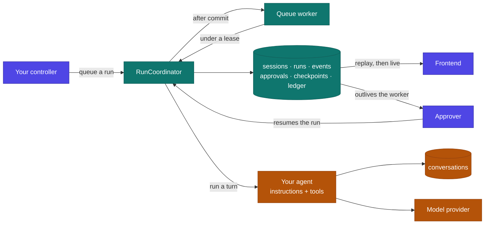

# Laravel Clutch

[](https://packagist.org/packages/obaid/laravel-clutch)
[](https://github.com/obaid/laravel-clutch/actions/workflows/tests.yml)
[](https://packagist.org/packages/obaid/laravel-clutch)
[](LICENSE.md)

An agent harness for Laravel, built on the official [Laravel AI SDK](https://laravel.com/docs/ai).

[Documentation](https://obaid.github.io/laravel-clutch/) · [Recipes](https://obaid.github.io/laravel-clutch/recipes/)

Laravel AI gives you the agent. Clutch is the harness around it: sessions that outlive a request, runs you can queue and resume, an ordered event history you can replay, human approvals that survive a deploy, budgets, cancellation, and artifacts.

```php
$session = Clutch::agent(ResearchAgent::class)->for($user)->create();

$result = $session->prompt('Research our competitors and recommend a wedge.');
```

That reads like an ordinary call, and it is. What changes is what remains afterward: a session you can continue tomorrow, a run record with usage and cost, and every event in order.

## Why this exists

Prompting an agent with Laravel AI is already easy:

```php
$response = (new ResearchAgent)->prompt('Research our competitors and write a brief.');
```

That is the engine. It talks to the model, runs the tool loop, and hands you a response.

The trouble starts when the work does not fit in one request. Say the agent has to read fifty pages, call a few APIs, write a document, and get sign off before publishing. While it runs, any of this can happen:

* Someone closes the browser and comes back after lunch.
* A deploy restarts the queue worker mid run.
* A rate limit forces a retry ten minutes later.
* The publishing tool succeeds, then the worker dies before recording that it did.
* The agent pauses for approval and gets an answer the next morning, from a different process.
* The frontend drops the connection after event 42 and needs the ones it missed.
* The run passes its cost ceiling and has to stop without corrupting anything.

Laravel AI covers a lot of ground already: agents, conversations, tools, streaming, queues, approvals, sub agents, MCP, structured output, and provider abstraction. What it deliberately leaves alone is the runtime that owns the whole lifecycle of that work.

So every application ends up writing the same layer. Session and run tables. Queue orchestration and execution locks. Status transitions and audit history. Stream persistence and reconnect logic. Approval endpoints and continuation jobs. Checkpoints, crash recovery, tool idempotency, cancellation, budgets, usage accounting, artifact storage, tenant isolation, redaction, and the commands to inspect all of it.

Clutch is that layer, written once.

| Question | Answered by |
| --- | --- |
| Which model should answer this prompt? | Laravel AI |
| Which tools can the model call? | Laravel AI and your application |
| What conversation context does the model get? | Laravel AI |
| Who owns the run after the HTTP request ends? | Clutch |
| What happens when the browser or worker disconnects? | Clutch |
| Has this tool already performed its side effect? | Clutch |
| How does an approval resume in another process? | Clutch |
| What happened, in what order, and at what cost? | Clutch |

Laravel AI runs the agent. Clutch is the harness that keeps it running safely across requests, workers, and deploys. It is not another model abstraction or agent framework, and it is built on Laravel's own queues, events, broadcasting, storage, policies, database, container, and testing fakes.

## Where it sits

Clutch wraps Laravel AI instead of replacing it. Your agents, tools, and provider configuration stay exactly as they are.



<sub>Indigo is yours. Teal is the harness. Amber is Laravel AI.</sub>

Laravel AI talks to the model, runs the tool loop, and remembers the conversation. The harness decides when a turn starts, what gets recorded, who may approve what, when to stop, and how to pick the work back up. Your application starts the work, renders progress, and decides who approves.

Durability comes from a few unglamorous rules. The queue job is dispatched only after the run's state commits. Events are written before they are broadcast. An approval resolved in a completely separate process is what wakes the run back up.

### What one turn does

```
   $session->prompt(…)
        │
        ├─ createRun ─────────────── run.created        ← one active run per session, held by a row lock
        ├─ acquire session lease ─────────────────────  ← one worker, or the job exits
        ├─ restore checkpoint ────────────────────────  ← the conversation the last turn left
        ├─ transition to running ── run.started
        │
        │   ┌─ driver: Laravel AI stream ──────────────┐
        │   │  step.started                            │
        │   │  text.delta × n                          │
        │   │  tool.call.requested   ← ledger checks   │  budgets checked at each
        │   │  tool.call.completed     idempotency     │  boundary; cancellation
        │   │  step.completed                          │  observed before a new step
        │   └──────────────────────────────────────────┘
        │
        ├─ store checkpoint ──────── checkpoint.created
        ├─ usage.updated
        └─ commit terminal state ── run.completed       ← state, result and event commit together;
                                                          the active-run slot clears in the same write
```

If the agent hits a tool that needs approval, the middle of that sequence ends at `run.awaiting_approval`, the worker exits, and everything resumes from the checkpoint once a decision arrives.

## Requirements

* PHP 8.3 or newer
* Laravel 12 or 13
* `laravel/ai` 0.11.x. Laravel AI is still pre-1.0, so the constraint pins the
  minor deliberately: a 0.12 release may move the interfaces Clutch builds on,
  and that should be verified before it is allowed.
* PostgreSQL for production. SQLite is fine for tests.
* Redis for queues, leases, and broadcasting

## Installation

```bash
composer require obaid/laravel-clutch

# The Clutch tables.
php artisan vendor:publish --provider="Clutch\Laravel\ClutchServiceProvider"

# Laravel AI's conversation tables, if you have not published them already.
# Session context lives there, so this step is not optional.
php artisan vendor:publish --provider="Laravel\Ai\AiServiceProvider"

php artisan migrate
```

Configure at least one Laravel AI provider the usual way.

Give agents a queue of their own while you are here. A run that takes four minutes should not sit in front of your password reset emails.

```env
CLUTCH_QUEUE_CONNECTION=redis
CLUTCH_QUEUE=agents
```

```bash
php artisan queue:work redis --queue=agents
```

## The mental model

Five nouns, and that is the whole surface.

| Concept | Meaning |
| --- | --- |
| Agent | A Laravel AI agent class: instructions and tools |
| Session | Durable identity, context, configuration, optional workspace |
| Run | One execution attempt inside a session |
| Event | An append only fact emitted during a run |
| Artifact | A durable output: a document, report, image, export |

A session holds many runs, one after another, and only one of them can be active at a time.

## Getting started

### Write an agent

```bash
php artisan make:clutch-agent ResearchAgent
```

You get an ordinary Laravel AI agent with one extra thing wired in:

```php
namespace App\Ai\Agents;

use Clutch\Laravel\Facades\Clutch;
use Laravel\Ai\Concerns\RemembersConversations;
use Laravel\Ai\Contracts\Agent;
use Laravel\Ai\Contracts\HasTools;
use Laravel\Ai\Contracts\RemembersConversations as RemembersConversationsContract;
use Laravel\Ai\Promptable;
use Stringable;

class ResearchAgent implements Agent, HasTools, RemembersConversationsContract
{
    use Promptable;

    // Laravel AI persists this agent's conversation, which is what lets a
    // harness session continue across requests, workers and deployments.
    use RemembersConversations;

    public function instructions(): Stringable|string
    {
        return 'You research competitors and write positioning briefs.';
    }

    public function tools(): iterable
    {
        return Clutch::policy([new SearchWeb, new FetchPage]);
    }
}
```

The `RemembersConversations` trait is doing real work here. Laravel AI only persists a conversation for agents that use it, and both durable sessions and cross process approvals depend on that conversation existing. Create a session with an agent that lacks the trait and the harness refuses, with an error that shows you the exact code to add. If the agent really is single turn, say so on purpose with `->configure('stateless', true)`.

### Create a session and prompt it

```php
use Clutch\Laravel\Facades\Clutch;
use App\Ai\Agents\ResearchAgent;

$session = Clutch::agent(ResearchAgent::class)
    ->for($request->user())
    ->name('Competitor research')
    ->create();

$result = $session->prompt(
    'Research our three closest competitors and recommend a positioning wedge.'
);

return [
    'session_id' => $session->id,
    'run_id' => $result->run->id,
    'text' => $result->text,
    'artifacts' => $result->artifacts,
    'usage' => $result->usage,
];
```

The session, run, events, tool activity, approvals, artifacts, usage, and terminal result are all persisted.

### Continue it later

```php
$session = Clutch::session($sessionId)->authorizeFor($request->user());

$result = $session->prompt('Turn the recommendation into a one-page strategy memo.');
```

The driver restores the right conversation and runtime state, so you never replay chat messages by hand.

## Background runs

Queue anything that will take a while:

```php
$run = $session->queue('Analyze every page on our website and produce a content gap report.');

return response()->accepted([
    'session_id' => $session->id,
    'run_id' => $run->id,
    'status' => $run->status,
]);
```

Queue behavior is configurable globally in `config/clutch.php`, or per session:

```php
$session = Clutch::agent(ResearchAgent::class)
    ->for($user)
    ->onConnection('redis')
    ->onQueue('agents')
    ->timeout(seconds: 900)
    ->create();
```

## Streaming and reconnecting

Stream a run straight from a controller:

```php
Route::post('/research', function (Request $request) {
    $session = Clutch::session($request->session_id)->authorizeFor($request->user());

    return $session
        ->stream('Create the report and explain your progress.')
        ->usingVercelDataProtocol();
});
```

That plugs directly into the Vercel AI SDK's `useChat`. Drop `usingVercelDataProtocol()` and you get the harness event envelope instead.

Queued runs are consumed through the event stream:

```http
GET /api/clutch/runs/{run}/events?after=42
Accept: text/event-stream
```

Every event carries a sequence number that only goes up. A browser that disconnects after event 42 reconnects with `after=42`, and the server replays what it stored before switching to live events.

Network delivery is at least once, so clients should deduplicate by `(run_id, sequence)`. Storage is exactly once and ordered.

The stored history is the same whether a run was streamed directly or executed on a queue, so a reconnecting client sees the same thing either way.

## Human approval

Approvable Laravel AI tools become durable harness approvals on their own.

```php
use Laravel\Ai\Concerns\InteractsWithApprovals;
use Laravel\Ai\Contracts\Approvable;

class PublishArticle implements Tool, Approvable
{
    use InteractsWithApprovals;

    // ...
}
```

When the agent reaches that tool the run pauses, a checkpoint is written, and the worker exits normally. Nothing sits open holding a connection. Hours later, in a different process:

```php
$run = Clutch::run($runId)->authorizeFor($user);

$run->approve(
    approvalId: $approvalId,
    reason: 'The content has been reviewed and may be published.',
);
```

Rejecting works the same way:

```php
$run->reject(
    approvalId: $approvalId,
    reason: 'Do not publish this draft. Remove the unsupported claim first.',
);
```

A rejection comes back to the agent as a tool result it can respond to, rather than killing the run outright.

Decisions are idempotent. Repeating one returns the existing result. Trying to reverse a resolved decision raises `ApprovalAlreadyResolved`.

Endpoints for all of this ship with the package:

```http
GET  /api/clutch/runs/{run}/approvals
POST /api/clutch/runs/{run}/approvals/{approval}/approve
POST /api/clutch/runs/{run}/approvals/{approval}/reject
```

Notifications are yours to wire up:

```php
Event::listen(ApprovalRequested::class, function (ApprovalRequested $event) {
    $event->approval->session->participant->notify(
        new AgentNeedsYou($event->approval)
    );
});
```

### Permission modes

```php
use Clutch\Laravel\Enums\PermissionMode;

$session = Clutch::agent(PublishingAgent::class)
    ->for($user)
    ->permissions(PermissionMode::ApproveSensitive)
    ->create();
```

| Mode | Behavior |
| --- | --- |
| `DenyByDefault` | Only explicitly allowed tools may run |
| `ApproveSensitive` | Safe tools run, sensitive ones need approval |
| `ApproveAll` | Every state changing tool needs approval |
| `AllowAll` | No harness approval, for trusted environments |

Classify tools in configuration:

```php
'permissions' => [
    'tools' => [
        'search_web' => 'read_only',
        'draft_email' => 'reversible',
        'send_email' => 'irreversible',
    ],
],
```

Or let a tool speak for itself:

```php
class PublishArticle implements Tool, SensitiveTool
{
    public function sensitivity(): ToolSensitivity
    {
        return ToolSensitivity::Irreversible;
    }
}
```

A tool you have not classified counts as sensitive.

For the mode to apply, pass your tool list through `Clutch::policy()`:

```php
public function tools(): iterable
{
    return Clutch::policy([
        new SearchWeb,
        new DraftEmail,
        new PublishArticle,
    ]);
}
```

Laravel AI asks the agent for its tools on every turn and that list is usually rebuilt each time, so the harness cannot rewrite it afterward. The agent hands it over instead. `make:clutch-agent` writes this for you.

With that in place, a tool the mode denies is withheld from the agent completely. The model is never told it exists, since refusing after the fact would still have exposed the capability. A tool that needs sign off is marked approvable, which is what pauses the run and creates the durable approval. Outside a harness run `Clutch::policy()` does nothing at all, so the same agent still behaves normally when you prompt it directly through Laravel AI.

A tool that asks for approval on its own, through Laravel AI's `requireApproval()`, is making its author's call rather than the harness's. `AllowAll` relaxes harness policy and leaves that alone.

A session can also name the tools it may use at all, which is coarser than the
permission mode and applies before it:

```php
Clutch::agent(SupportAgent::class)->onlyTools(['search_orders', 'draft_reply'])->create();
Clutch::agent(SupportAgent::class)->withoutTools(['issue_refund'])->create();
```

An allow list is absolute: anything absent is withheld whatever the mode would
have permitted. Tools that survive the list are still subject to the mode, so an
irreversible tool on an allow list still asks for approval.

Laravel authorization policies apply regardless of mode. Application rules can layer on as well, and the most restrictive answer wins:

```php
app(PolicyEngine::class)->extend(function (ToolInvocation $invocation, ToolSensitivity $sensitivity) {
    return $invocation->tenantId && Team::find($invocation->tenantId)?->on_trial
        ? PolicyDecision::requireApproval('Trial teams review every write.')
        : null; // Defer to the other rules.
});
```


## Skills

Instructions describe how an agent always behaves. A skill describes how to do
one particular job, and only takes up context while that job is at hand.

```php
use Clutch\Laravel\Skills\Skill;
use Clutch\Laravel\Skills\SkillRegistry;

app(SkillRegistry::class)->add(new Skill(
    name: 'refund-policy',
    description: 'How we decide and process a refund.',
    content: <<<'TEXT'
    Refunds under $50 are automatic. Above that, check the account age first...
    TEXT,
));
```

Or keep them as files, one directory per skill with a `SKILL.md` inside:

```php
// config/clutch.php
'skills' => ['path' => resource_path('skills')],
```

The model sees every skill's name and description, and pulls in the body of the
one it needs. Ten procedures pasted into instructions cost tokens on every turn
of every session; ten skills cost a line each until one is used.

Give a session a subset when it should not see everything:

```php
Clutch::agent(SupportAgent::class)->withSkills(['refund-policy'])->create();
```

## Long runs that outlive a worker

A run that takes twenty minutes will meet a queue worker timeout. Rather than
being killed part-way through a step, a run can hand the turn back at a safe
boundary and be re-queued to continue:

```php
Clutch::agent(ResearchAgent::class)
    ->for($user)
    ->sliceAfterSeconds(240)   // below your worker's timeout
    ->create();
```

Each slice checkpoints, records a `run.suspended` event, and queues the
continuation. Usage accumulates across slices, so a run cut into ten pieces
still meets its budget as one run.

Slicing needs a driver that can park a turn and pick it up again. The bundled
`laravel-ai` driver cannot: Laravel AI runs a turn to completion, and abandoning
it part-way discards the work rather than parking it. Asking that driver to slice
fails with `CapabilityUnsupported` before the run starts, which is the same
promise the package makes everywhere else.

## Keeping a run on the rails

Budgets stop a run that is expensive. They do nothing about one that is cheap
and useless, like an agent calling the same tool with the same arguments forty
times. Loop guards notice that shape:

```php
// config/clutch.php
'guards' => [
    'remind_after_repeats' => 3,   // tell the model it is going in circles
    'block_after_repeats' => 8,    // refuse, and say why
    'tool_timeout_seconds' => 60,  // bound one call, not just the whole run
    'tool_timeouts' => ['scrape_page' => 120],
],
```

A reminder still lets the call run. A block returns the refusal to the model as
the tool result, which is what tells the agent to try something else rather than
leaving it silently starved.

Tool deadlines cover what a run-level duration budget cannot: a budget only
notices an overrun once the tool returns, which is no help when the tool is the
thing that hung.

## Oversized tool output

A tool that returns a 400KB page dump poisons every later step. The model pays
for it on each turn, and the context fills with text nobody reads.

```php
// config/clutch.php
'spill' => [
    'enabled' => true,
    'threshold_bytes' => 8192,
    'preview_bytes' => 1024,
],
```

Past the threshold, the full output is written to an artifact and the model gets
a bounded preview plus the artifact id, with the truncation stated plainly so it
does not answer from the fragment as though it were the whole thing. The full
text stays downloadable through the ordinary artifact route.

## Compaction

A long session accumulates conversation until every turn pays for the whole
history. Compaction summarizes the middle of it, keeping the earliest turns
(which hold the task) and the most recent (which hold the state).

```php
// config/clutch.php
'compaction' => [
    'enabled' => true,
    'trigger_at_fraction' => 0.7,  // of the token budget
    'keep_first' => 2,
    'keep_recent' => 8,
],
```

The summary comes from Laravel AI's own `SummarizeAgent`, which is marked to use
the cheapest model available, so compaction does not cost more than the context
it saves. It is off by default: quietly rewriting an application's conversation
is not something to do without being asked.

## Budgets

Constrain a session or a single run:

```php
use Clutch\Laravel\ValueObjects\RunBudget;

$session = Clutch::agent(ResearchAgent::class)
    ->for($user)
    ->budget(new RunBudget(
        maxSteps: 40,
        maxToolCalls: 100,
        maxTokens: 250_000,
        maxCostUsd: 8.00,
        maxDurationSeconds: 900,
    ))
    ->create();
```

Budgets layer: configuration defaults first, then the session, then the run. At each level the more restrictive limit wins, so a session can tighten a ceiling but never raise it.

A run that hits a hard limit moves to `budget_exceeded`, emits a terminal event naming the limit that ran out, and keeps its last safe checkpoint.

Usage carries across attempts, so a retry loop cannot spend the same budget three times. Reset it when you actually mean to:

```php
$run->retry(resetBudget: true);
```

`maxCostUsd` needs prices to work against:

```php
// config/clutch.php
'pricing' => [
    'anthropic:claude-sonnet-4-5' => ['input' => 3.00, 'output' => 15.00],
    'openai:gpt-5' => ['input' => 1.25, 'output' => 10.00],
],
```

An unpriced model contributes `0.00` rather than a guess. That shows up in the usage record, which beats a plausible number that happens to be wrong.

## Cancellation

```php
$run = Clutch::run($runId)->authorizeFor($user);

$run->cancel(reason: 'The request is no longer needed.');
```

Cancellation is cooperative. The request is recorded immediately, the active driver is signalled, and no new model step or tool starts after that. A tool already running may finish, unless it supports interruption. The package does not pretend otherwise.

Long running tools can cooperate:

```php
public function handle(Request $request): string
{
    foreach ($this->pages() as $page) {
        if (RunContext::current()?->isCancelled()) {
            break;
        }

        $this->analyze($page);
    }
}
```

## Artifacts

Agents and tools attach durable outputs to a run:

```php
use Clutch\Laravel\Artifacts\Artifact;
use Clutch\Laravel\Runtime\RunContext;

$artifact = Artifact::fromStorage(disk: 's3', path: 'reports/content-gap-2026-08-24.pdf')
    ->name('Content gap report')
    ->mimeType('application/pdf')
    ->metadata(['pages' => 18]);

RunContext::current()->artifacts()->add($artifact);
```

Or write the bytes as part of attaching them:

```php
Artifact::fromContents($markdown, 'reports/gap.md')->name('Content gap report');
```

Read them back from a result or a run:

```php
$artifacts = $result->artifacts;
$artifacts = Clutch::run($runId)->artifacts;
```

Contents stay on the filesystem disk you configured. The database holds metadata, ownership, a SHA-256 for integrity, and a storage reference. The bytes never land in an event payload.

## Idempotent tools

Any tool with an external side effect should implement `IdempotentTool`:

```php
use Clutch\Laravel\Contracts\IdempotentTool;
use Clutch\Laravel\Data\ToolInvocation;
use Laravel\Ai\Contracts\Tool;

final class PublishArticle implements Tool, IdempotentTool
{
    public function idempotencyKey(ToolInvocation $invocation): string
    {
        // Key the side effect, not the call. Two retries of "publish article 42"
        // must produce the same key even though the tool-call IDs differ.
        return 'publish-article:'.$invocation->arguments['article_id'];
    }

    // Standard Laravel AI tool methods...
}
```

The key and a pending row are committed before the tool runs, so a worker that dies halfway through still leaves evidence behind. A repeat invocation returns the stored result instead of firing the side effect again.

A tool with no idempotency contract still gets recorded for audit, but the harness makes no duplicate suppression claim for it. Only you know what counts as the same action.

## Events

Every event uses one envelope:

```json
{
  "id": "evt_01j...",
  "session_id": "ses_01j...",
  "run_id": "run_01j...",
  "sequence": 42,
  "type": "tool.call.requested",
  "occurred_at": "2026-08-24T21:15:12.381Z",
  "payload": {
    "tool_call_id": "call_01j...",
    "tool": "dataforseo.keyword_ideas",
    "arguments": { "keyword": "AI receptionist" }
  }
}
```

The core types:

`run.created` · `run.queued` · `run.started` · `text.delta` · `reasoning.delta` · `step.started` · `step.completed` · `tool.call.requested` · `tool.call.completed` · `tool.call.failed` · `approval.requested` · `approval.resolved` · `artifact.created` · `usage.updated` · `checkpoint.created` · `run.awaiting_approval` · `run.completed` · `run.failed` · `run.cancelled` · `run.budget_exceeded`

Listen through Laravel events, with no dependency on the transport:

```php
use Clutch\Laravel\Events\ClutchEventRecorded;

Event::listen(ClutchEventRecorded::class, function (ClutchEventRecorded $event) {
    // Audit, analytics, metering, notifications, or your own broadcasting.
});
```

### Redaction

Redaction runs before persistence, not before display, so a configured key never reaches the database:

```php
'events' => [
    'redact' => ['authorization', 'api_key', 'token', 'password', 'secret'],
],
```

Tool arguments often carry business sensitive values that are not secrets. Register a serializer that keeps only the fields you approve:

```php
class EmailEventSerializer implements EventSerializer
{
    public function serialize(array $payload): array
    {
        return [
            'tool' => $payload['tool'],
            'arguments' => ['recipient_count' => count($payload['arguments']['to'])],
        ];
    }
}
```

```php
'events' => [
    'serializers' => ['send_email' => EmailEventSerializer::class],
],
```

## Structured output

Structured Laravel AI agents work as they normally do:

```php
$result = $session->prompt('Score this draft against our content rubric.');

$score = $result->structured['score'];
```

The validated value is stored on the terminal run record and emitted with `run.completed`.

## Drivers

The default `laravel-ai` driver runs ordinary Laravel AI agents inside your own workers:

```php
$session = Clutch::agent(ResearchAgent::class)->driver('laravel-ai')->create();
```

Drivers put different runtimes behind one set of session, run, event, approval, checkpoint, and artifact contracts.

```php
// A future coding-agent driver.
$session = Clutch::runtime('codex')
    ->for($user)
    ->workspace($repository)
    ->sandbox('e2b')
    ->create();
```

Every driver declares what it can do, and the harness checks before it acts. Asking for something a driver does not support fails with `CapabilityUnsupported` before any work begins, so a safety or durability feature never quietly degrades into something weaker.

Writing a driver? There is a shared contract suite you can point at it:

```php
use Clutch\Laravel\Testing\DriverContractTests;

it('passes the harness driver contract', function () {
    $result = DriverContractTests::for(new MyDriver)->run();

    expect($result['passed'])->toContain('round-trips a checkpoint');
});
```

Capabilities you do not declare are skipped rather than failed, so a deliberately limited driver still passes. What it cannot do is claim a capability it lacks.

## Workspaces and sandboxes

Application agents do not need a sandbox. Laravel AI tools run in the Laravel host under your normal authorization.

Runtimes that want a filesystem, shell, browser, or isolated process can ask for a workspace and a sandbox provider. Those providers are optional extensions, and the default driver uses `NullSandboxProvider`.

Secrets are resolved at runtime, scoped to the session, and never written into event payloads, checkpoints, artifacts, or the visible workspace. The checkpoint store enforces this: a driver that tries to checkpoint a configured secret key gets an exception rather than a quietly stripped value.

## Inspecting runs

```bash
php artisan clutch:sessions              # list sessions
php artisan clutch:run {run-id}          # inspect one run
php artisan clutch:events {run-id}       # replay its event history
php artisan clutch:retry {run-id}        # queue a fresh attempt
php artisan clutch:cancel {run-id}       # request cooperative cancellation
php artisan clutch:reap                  # recover runs whose worker vanished
php artisan clutch:prune                 # apply retention windows
```

`clutch:events` prints a readable timeline:

```
   1 21:15:09.204 run.created      Research our three closest competitors
   2 21:15:09.211 run.started
   3 21:15:09.980 step.started
   4 21:15:10.442 tool.call.requested   search_web {"query":"competitor pricing"}
   5 21:15:12.118 tool.call.completed   search_web → "12 results"
   6 21:15:12.940 text.delta            Their weakest flank is onboarding...
   7 21:15:13.002 usage.updated         tokens=1841
   8 21:15:13.010 run.completed         Their weakest flank is onboarding.
```

Sensitive fields are already gone, because they never reached storage.

## Testing

Fake the harness. No provider, no queue worker, no network, but the real coordinator, event store, approvals, and artifacts:

```php
use Clutch\Laravel\Facades\Clutch;
use Clutch\Laravel\Runtime\ClutchResult;

Clutch::fake([
    'Draft a brief' => ClutchResult::text('The proposed brief...'),
]);

$session = Clutch::agent(ResearchAgent::class)->for($user)->create();

$session->queue('Draft a brief');

Clutch::assertSessionCreated(ResearchAgent::class);
Clutch::assertRunQueued('Draft a brief');
Clutch::assertRunCompleted();
Clutch::assertNothingAwaitingApproval();
```

Test a paused run:

```php
Clutch::fake([
    ClutchResult::awaitingApproval(
        tool: 'publish_article',
        arguments: ['article_id' => 123],
    ),
]);

$run = $session->queue('Publish the approved article.');

Clutch::assertApprovalRequested('publish_article');
```

Script richer ones:

```php
Clutch::fake([
    ClutchResult::text('Report ready.')
        ->withToolCall('search_web', ['q' => 'pricing'], '12 results')
        ->withArtifact(Artifact::fromContents($pdf, 'report.pdf')->name('Report')),

    ClutchResult::structured(['score' => 87]),
    ClutchResult::failure('The provider is down.'),
]);
```

The assertions available: `assertSessionCreated`, `assertNoSessionCreated`, `assertRunQueued`, `assertRunCompleted`, `assertRunFailed`, `assertRunCancelled`, `assertRunExceededBudget`, `assertRunAwaitingApproval`, `assertApprovalRequested`, `assertApproved`, `assertRejected`, `assertNothingAwaitingApproval`, `assertArtifactCreated`, `assertEventRecorded`, `assertPromptedTimes`, `assertNothingPrompted`.

Failure messages say what actually happened:

```
Expected a harness run to have reached [completed] for a prompt containing [Draft a brief].
Runs recorded: awaiting_approval ("Draft a brief")
```

## Configuration

The published `config/clutch.php` is commented throughout. The keys you will touch first:

```php
return [
    'default_driver' => env('CLUTCH_DRIVER', 'laravel-ai'),

    'queue' => [
        'connection' => env('CLUTCH_QUEUE_CONNECTION'),
        'queue' => env('CLUTCH_QUEUE', 'agents'),
        'timeout' => 900,
    ],

    'permissions' => [
        'default' => PermissionMode::ApproveSensitive->value,
        'tools' => [
            'search_web' => 'read_only',
            'draft_email' => 'reversible',
            'send_email' => 'irreversible',
        ],
    ],

    'events' => [
        'broadcast' => true,
        'persist_deltas' => true,
        'redact' => ['authorization', 'api_key', 'token', 'password', 'secret'],
        'serializers' => [],
    ],

    'budgets' => [
        'max_steps' => 50,
        'max_tool_calls' => 100,
        'max_tokens' => 250_000,
        'max_cost_usd' => null,
        'max_duration_seconds' => 900,
    ],

    'retention' => [
        'events' => 90,
        'checkpoints' => 30,
        'artifacts' => 365,
    ],

    'routes' => [
        'enabled' => true,
        'prefix' => 'api/clutch',
        'middleware' => ['api', 'auth'],
    ],
];
```

Set `routes.enabled` to `false` if you would rather own the HTTP surface yourself.

## What it guarantees

1. One active run per session.
2. Ordered, append only run events.
3. Durable terminal run state.
4. Replayable events after a client reconnects.
5. Idempotent approval decisions.
6. No new step after cancellation is observed.
7. Unsupported driver capabilities fail loudly.
8. Secrets stay out of persisted payloads.
9. Retrying an idempotent tool does not repeat its side effect.
10. A run is never reported complete before its terminal event and result are committed.
11. A suspended turn resumes from its checkpoint without repeating finished work.
12. A blocked tool call never reaches the tool.

Each of these has a named test, so a regression shows up as a failure with a name on it rather than as strange behavior in production.

### What it does not

The `laravel-ai` driver checkpoints at safe model and tool boundaries. It does not promise byte perfect continuation from the middle of an active provider request. If a worker dies during that request the current step may run again, which is exactly why side effecting tools need an idempotency contract.

It also will not claim to interrupt a tool that cannot be interrupted, and it cannot make a non idempotent external action safe to retry.

## A demo you can try to break

[obaid/laravel-clutch-demo](https://github.com/obaid/laravel-clutch-demo) is a
small Laravel app where an agent researches a topic, drafts a post, and stops to
ask before publishing. Every screen is something that would go wrong in a naive
build: close the tab and the work carries on, reload mid-run and the stream
resumes from your cursor, kill the worker and the reaper recovers the run from
its checkpoint.

## Documentation

Full docs at [obaid.github.io/laravel-clutch](https://obaid.github.io/laravel-clutch/), including [recipes](https://obaid.github.io/laravel-clutch/recipes/) for approval inboxes, live progress UIs, multi tenant scoping, and spend caps.

## License

MIT
